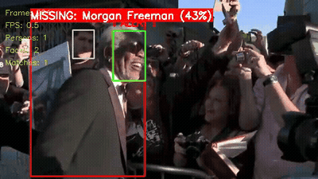
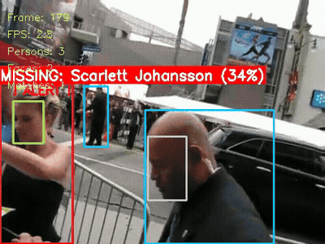

# Missing Person Detection System

Real-time missing person detection in video and webcam feeds using YOLOv8 + InsightFace (ArcFace). The system detects persons, extracts 512-d face embeddings, and matches them against a database of missing persons using cosine similarity.

## Demo

| Morgan Freeman | Scarlett Johansson |
|:-:|:-:|
|  |  |
| Detected at movie premiere (62% peak) | Detected at Avengers premiere (35% peak) |

## Architecture

```
Input (Video / Webcam / RTSP)
        |
        v
  +------------------+
  | YOLOv8 Detection |  --> Detect all PERSONS in frame
  +------------------+
        |
        v (crop each person)
  +---------------------+
  | InsightFace         |  --> Find FACES + generate 512-d EMBEDDING
  | (ArcFace ResNet100) |
  +---------------------+
        |
        v (cosine similarity)
  +------------------+
  | Face Recognition |  --> Match against missing person DATABASE
  +------------------+
        |
        v
  ALERT if match!
```

## Installation

### Option A: pip

```bash
cd MissingPersonDetection
pip install -r requirements.txt
```

### Option B: Docker

```bash
# Build
docker build -t missing-person-detection .

# Run on a video file
docker run --rm \
  -v $(pwd)/missing_persons_db:/app/missing_persons_db \
  -v $(pwd)/output:/app/output \
  -v /path/to/videos:/app/videos \
  missing-person-detection \
  --video /app/videos/input.mp4 --output /app/output/result.mp4 --no-display

# Run on RTSP stream
docker run --rm \
  -v $(pwd)/missing_persons_db:/app/missing_persons_db \
  -v $(pwd)/output:/app/output \
  missing-person-detection \
  --video rtsp://192.168.1.100:554/stream --output /app/output/stream.mp4 --no-display

# Run training notebook
docker compose up train
# Then open http://localhost:8888
```

Or use **docker compose**:

```bash
docker compose up detect                                                  # Video file (videos/input.mp4)
STREAM_URL=rtsp://192.168.1.100:554/stream docker compose up detect-stream  # RTSP stream
docker compose up train                                                     # Jupyter notebook
```

Key dependencies: `ultralytics` (YOLOv8), `insightface` (ArcFace), `onnxruntime`, `opencv-python`

## Usage

### Step 1: Prepare missing person photos

```
missing_persons_db/
  person_001/
    name.txt          # "John Doe"
    photo1.jpg        # Clear frontal face
    photo2.jpg        # Side angle
    photo3.jpg        # Different lighting
  person_002/
    name.txt
    photo1.jpg
```

- 3-5 photos per person from different angles and lighting
- Face should be clear and unobstructed
- Minimum 100x100 pixels for face region

### Step 2: Build embeddings database

```bash
jupyter notebook train_face_recognition.ipynb
```

The notebook will:
1. Load and display images from database
2. Generate ArcFace 512-d embeddings for each person
3. Evaluate embedding quality (intra/inter-person cosine similarity)
4. Find optimal recognition threshold
5. Save `embeddings.pkl`

### Step 3: Run detection

```bash
# Video file
python detect_missing_person.py --video path/to/crowd_video.mp4

# Save output
python detect_missing_person.py --video path/to/video.mp4 --output output/result.mp4

# Real-time webcam
python detect_missing_person.py --webcam
python detect_missing_person.py --webcam --camera-id 1

# RTSP / IP camera stream
python detect_missing_person.py --video rtsp://192.168.1.100:554/stream

# Custom parameters
python detect_missing_person.py \
    --video path/to/video.mp4 \
    --output output/result.mp4 \
    --threshold 0.5 \
    --skip 3 \
    --no-display
```

Press `q` to stop at any time. `--video` and `--webcam` are mutually exclusive.

### Command-line arguments

| Argument      | Description                                    | Default  |
|---------------|------------------------------------------------|----------|
| `--video`     | Input video path or stream URL                 | -        |
| `--webcam`    | Use webcam for real-time detection             | False    |
| `--camera-id` | Camera device index (used with `--webcam`)     | 0        |
| `--output`    | Output video path                              | None     |
| `--db`        | Path to embeddings.pkl                         | config   |
| `--threshold` | Cosine similarity threshold (higher = stricter)| 0.4      |
| `--skip`      | Process every N frames                         | 5        |
| `--no-display`| Disable video display window                   | False    |

## Project Structure

```
MissingPersonDetection/
  config.py                    # System configuration
  requirements.txt             # Dependencies
  detect_missing_person.py     # Main detection pipeline
  train_face_recognition.ipynb # Embeddings & training notebook
  Dockerfile                   # Docker container
  docker-compose.yml           # Docker compose services
  missing_persons_db/          # Missing person photos
    person_001/
    person_002/
    embeddings.pkl             # Generated embeddings
  utils/
    __init__.py
    person_detector.py         # YOLO person detection
    face_detector.py           # InsightFace face detection
    face_recognizer.py         # Cosine similarity matching
  output/                      # Output videos & metrics
```

## Tuning

Edit `config.py`:

| Parameter | Description | Default |
|-----------|-------------|---------|
| `RECOGNITION_THRESHOLD` | Cosine similarity threshold. Higher = fewer false positives, lower = more matches | 0.4 |
| `FRAME_SKIP` | Process every N frames. Lower = more accurate, higher = faster | 5 |
| `INSIGHTFACE_MODEL` | `"buffalo_l"` (accurate) or `"buffalo_s"` (fast) | `"buffalo_l"` |
| `YOLO_CONFIDENCE_THRESHOLD` | Person detection confidence | 0.5 |
| `FACE_DETECTION_THRESHOLD` | Face detection confidence | 0.5 |

## Model Performance

Evaluated using `train_face_recognition.ipynb` on a database of **3 persons** (Morgan Freeman, Keanu Reeves, Scarlett Johansson) with **3 photos each** (9 total embeddings).

### Database Overview


### Embedding Generation

| Metric | Value |
|--------|-------|
| Model | ArcFace ResNet100 (buffalo_l) |
| Embedding dimensions | 512-d |
| Persons | 3 |
| Total embeddings | 9 |
| Face detection rate | 100% (9/9) |

### Embedding Quality

**Intra-person similarity** (same person — higher is better):

| Person | Avg | Min | Pairs |
|--------|-----|-----|-------|
| Morgan Freeman | 0.552 | 0.465 | 3 |
| Keanu Reeves | 0.245 | 0.038 | 3 |
| Scarlett Johansson | 0.643 | 0.616 | 3 |
| **Overall** | **0.480** | **0.038** | **9** |

**Inter-person similarity** (different persons — lower is better):

| Pair | Avg | Max |
|------|-----|-----|
| Morgan Freeman vs Keanu Reeves | -0.007 | 0.048 |
| Morgan Freeman vs Scarlett Johansson | -0.005 | 0.046 |
| Keanu Reeves vs Scarlett Johansson | -0.028 | 0.035 |
| **Overall** | **-0.013** | **0.048** |

Inter-person similarity is near zero across all pairs, indicating excellent identity separation. Keanu Reeves has lower intra-person similarity due to significant appearance variation across photos (different years, facial hair).

### Similarity Distribution


Clear separation between intra-person (blue) and inter-person (red) distributions. The green dashed line marks the config threshold (0.4).

### Threshold Tuning & ROC Curve


| Metric | Value |
|--------|-------|
| Optimal threshold (by F1) | 0.20 |
| F1 Score | 0.875 |
| Recall | 77.8% |
| Accuracy | 94.4% |
| AUC | 0.990 |
| Config threshold | **0.40** |

The left plot shows accuracy, recall, and F1 score across threshold values. The orange line marks the F1-optimal threshold (0.20) and the red dashed line marks the config default (0.40). The right plot shows the ROC curve (AUC = 0.990).

> **Important:** These metrics are evaluated on a small closed set of 3 known persons only. Real-world performance will differ because the system encounters unknown strangers — the main source of false positives — that this evaluation cannot capture. The config default of **0.4** is intentionally conservative to minimize false alerts. Tune based on your deployment testing.

### Key Takeaways

- **Inter-person separation is excellent** — max inter-person similarity (0.048) is far below the config threshold (0.4)
- **Intra-person consistency varies** — Scarlett Johansson (avg 0.643) vs Keanu Reeves (avg 0.245) due to appearance changes across photos
- **No retraining needed** — cosine similarity matching lets you add/remove persons from the database instantly
- **More reference photos = better accuracy** — especially with diverse angles and lighting conditions

## Comparison: InsightFace vs dlib

| Feature            | InsightFace (ArcFace)      | dlib (face_recognition)  |
|--------------------|----------------------------|--------------------------|
| Embedding          | 512-d                      | 128-d                    |
| Accuracy (LFW)     | 99.77%                     | 99.38%                   |
| macOS ARM install  | pip install (easy)         | Requires building dlib   |
| Model              | ArcFace ResNet100          | dlib ResNet              |
| Comparison method  | Cosine similarity          | L2 distance              |
