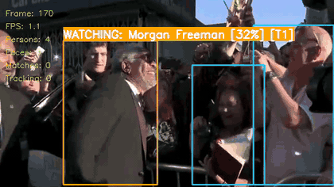
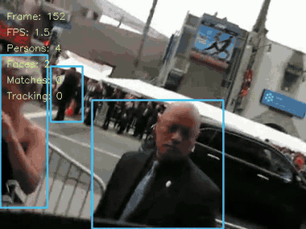
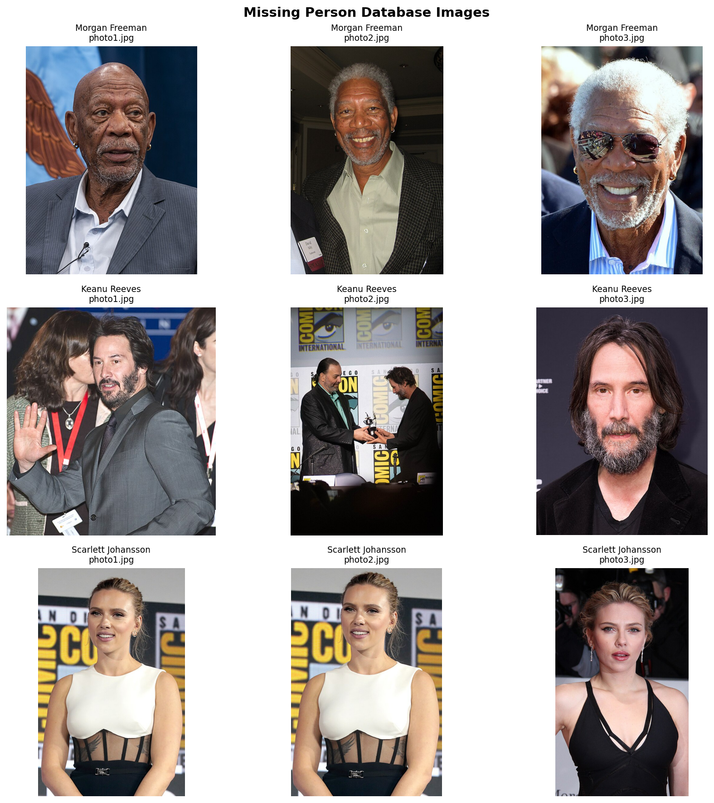
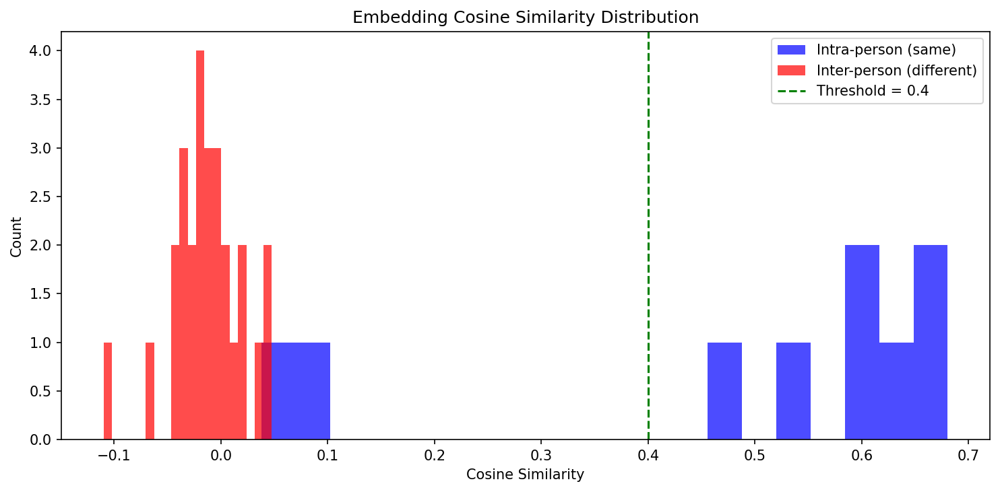
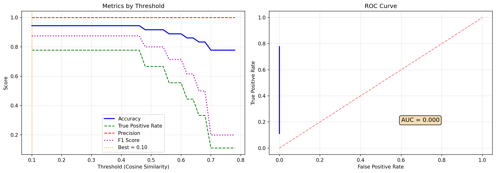

# Missing Person Detection on the Edge — Project Report

*Team project for the Intelligent Edge System course.*

## Project overview

We built a system that scans a camera feed (or an uploaded video) for
people, checks whether any of them match a short "missing persons"
database, and raises an alert when it finds one. The whole pipeline
runs locally, which matters for this course: we wanted to show that a
practical surveillance tool can work on edge hardware without streaming
every frame to a cloud service.

The output looks like this:

| Morgan Freeman | Scarlett Johansson |
|:-:|:-:|
|  |  |
| Transition WATCHING → LOCKED at ~53% (peak 63%) | Low-confidence demo, LOCKED at ~37% |

The orange box is the system accumulating evidence (WATCHING), the red
box is a confirmed lock, and the inset in the bottom-right is a small
tactical view with a trail for each locked target.

## Why edge and not cloud

Two reasons this fits an edge deployment better than a hosted API:

1. **Latency.** Even at 10 FPS capture, a round trip to a cloud
   inference service adds 150–400 ms per frame. For a tracking
   system, that is the difference between a bbox that sticks to the
   person and one that lags half a step behind.
2. **Privacy and connectivity.** Video of people in a public space is
   sensitive. Keeping inference on-device means the raw frames never
   leave the network, and the system still works when the link is
   down. It just can't report outward — which is acceptable for a
   scanner that still records locally.

The whole thing runs on CPU on our development machines (Mac and
Linux), with no GPU required. Every model we picked is small enough
to load in a few seconds and execute in tens of milliseconds per
frame.

## System architecture

```
          ┌─────────────────┐
  camera  │                 │  annotated
 / video ─┤  Edge Pipeline  ├─► frames + events
 / file   │                 │  (WebSocket / HTTP)
          └───────┬─────────┘
                  │
         ┌────────┼─────────┬──────────────┐
         ▼        ▼         ▼              ▼
      YOLOv8   ArcFace   ByteTrack   State Machine
      (persons)(faces +  (identity   (IDLE → WATCHING
               embeddings)persistence) → LOCKED)
```

Every processed frame flows through the four stages left-to-right.
The state machine sits on top of ByteTrack so that noisy per-frame
similarities become a stable decision about *who* is on screen, not
just *what* scores we saw this millisecond.

## The AI models we used

We reused three open models rather than training our own. For a
semester project that lets us focus engineering time on integration
and on the logic that ties everything together.

### 1. Person detection — YOLOv8n

YOLOv8 is a single-shot detector from Ultralytics. Single-shot means
one forward pass through the network produces all bounding-box
predictions at once — there's no separate region proposal network
like in Faster R-CNN. The variant we use, `yolov8n` ("nano"), has
around 3.2 M parameters and is designed for CPU / edge inference.

At a high level the model looks like this:

```
  input image (640×640)
        │
        ▼
  CSPDarknet backbone   → multi-scale feature maps
        │
        ▼
  PAN-FPN neck          → fused features at 3 resolutions
        │
        ▼
  anchor-free head      → (bbox, class, confidence) per grid cell
        │
        ▼
  NMS + threshold       → final person bounding boxes
```

We only use the `person` class (COCO class 0) and throw away everything
else. In our config, `YOLO_CONFIDENCE_THRESHOLD = 0.5` is the minimum
score for a detection to survive.

### 2. Face detection + embeddings — InsightFace (buffalo_l)

For every person bbox, we crop that region and hand it to InsightFace.
The `buffalo_l` bundle is actually two networks glued together:

- **RetinaFace** for face detection inside the crop. It outputs a
  face bounding box plus 5 landmarks (eyes, nose, mouth corners).
  Those landmarks are used to align the face into a canonical pose
  before the embedding step, which matters a lot for matching.
- **ArcFace (ResNet100)** for the actual embedding. The aligned
  112×112 face goes through a ResNet-100 backbone trained with the
  ArcFace loss. The output is a 512-dimensional vector normalised to
  the unit sphere.

ArcFace's key idea is an **additive angular margin** in the loss
function: during training it pushes the angle between different
identities apart by a fixed margin while pulling same-identity samples
together. The practical effect is that cosine similarity between
normalised embeddings becomes a very clean similarity signal. Same
person, same lighting, different pose ≈ 0.5–0.7. Different person ≈
around 0.

We precompute one embedding per reference photo of each missing
person and store them in `embeddings.pkl`. At runtime we compare the
current face embedding against all stored embeddings with cosine
similarity — the best match is what drives the state machine.



*Reference database used for evaluation: three missing persons with three photos each.*

How well-separated are those embeddings? We measured intra-person
vs. inter-person cosine similarity on our database:



The blue distribution (same person across photos) sits well above
the red distribution (different persons). The max inter-person
similarity on our set is around 0.05, the minimum intra-person
similarity is around 0.04 (one of the Keanu Reeves photos is really
dissimilar from the others). We picked **0.4** as the default
recognition threshold — comfortably above all the inter-person noise
and below most of the intra-person signal.



*F1-optimal threshold would be 0.20, but we intentionally chose a more
conservative 0.40 to keep false positives low on unknown strangers
(which the closed-set evaluation can't capture).*

### 3. Multi-object tracking — ByteTrack

ByteTrack turns per-frame detections into consistent track IDs. For
each active track it runs:

- a **Kalman filter** that predicts where the track will be next,
  using a constant-velocity motion model,
- a **two-stage matching** step that associates incoming detections
  to existing tracks by IoU. High-confidence detections are matched
  first; the surviving low-confidence detections get a second chance
  against unmatched tracks. This is the "BYTE" idea — don't throw
  away weak detections, they often keep a track alive through short
  occlusions.
- a **lost-track buffer** that keeps an un-matched track alive for
  a configurable number of frames before retiring its ID.

We use the implementation from the `supervision` library and feed it
only the YOLO person detections.

## Our state machine on top

ByteTrack gives us stable IDs. Face matching gives us noisy per-frame
similarities. By themselves neither is enough — we still need to
decide *when* the system should say "this track is person X". So we
wrote a small state machine per track:

```
                  similarity ≥ 0.35
  IDLE ──────────────────────────────► WATCHING
    ▲    (2 consecutive frames)           │
    │                                     │  weighted ≥ 0.40
    │                                     │  AND peak ≥ 0.50
    │                                     ▼
    │                                 LOCKED
    │                                     │
    │    re-verify fails / bbox lost      │
    └─────────────────────────────────────┘
```

Notable design choices:

- **Re-verify instead of re-score.** Once LOCKED, we don't update the
  identity per frame. Every 30 processed frames we simply check that
  the face *still* matches. This stops the label from flickering
  and makes the track behave like a soft lock rather than a hard
  per-frame classifier.
- **Two separate exit conditions.** Re-verify failure (3 consecutive
  low checks) handles the "wrong person but the same track slot"
  case. A 2-second bbox-lost timeout handles the "person briefly
  occluded" case. We also drop the track immediately if more than
  60% of its bbox leaves the image — we know they're gone, no need
  to wait.
- **Identity freeze.** The person name, ID, and best-similarity are
  frozen the moment a track enters LOCKED. Re-verification can
  unseat the lock, but it can't rename it.

## Problems we hit

Three worth calling out because the fixes were more interesting than
the bugs.

### "My face got labelled as Morgan Freeman"

When one of us held up a printed photo of Morgan Freeman, YOLO
correctly detected two persons (the photo and the person holding it).
Face detection found two faces. Our tracker then labelled *both* tracks
as Morgan, because any face whose bbox overlapped a track bbox by
≥30% IoU was a candidate, and both tracks picked the higher-scoring
face.

The fix was to treat face→track assignment as a **1:1 bipartite
assignment**, scored by *containment* (how much of the face bbox sits
inside the person bbox), tie-broken by face-centre to track-centre
distance. Once each face can only be used by one track, the small
photo bbox "claims" Morgan, and the person-holding-the-photo gets
their own face back.

### Velocity drift in predicted bboxes

Our initial prediction-between-detections logic overwrote
`last_bbox` with the predicted position on every skipped frame.
The next real detection's velocity was then computed from a
predicted point, not an actual one. The bboxes visibly lagged
behind fast-moving people.

We split the state into two fields: `last_detection_bbox` (only the
detector writes to this) and `last_bbox` (used for drawing, may be
a prediction). Velocity is derived only from actual detections, so
it stays accurate across skipped frames.

### ByteTrack recycling track IDs

ByteTrack reuses track IDs after its lost buffer expires. If person A
walks out and person B walks in within about a second, B can get A's
old ID. Our state kept the LOCKED identity associated with that slot,
so B would be incorrectly labelled as A for several frames until
re-verify caught up.

The fix detects the tell-tale signature of an ID being recycled: a
visual gap of ≥ 0.4 s combined with a spatial jump larger than 1.5
bbox-diagonals. When we see that pattern we wipe the slot entirely
before treating the new detection, so B starts from a clean IDLE
state.

## The web interface

We wrapped the pipeline in a FastAPI backend with a plain HTML / JS
frontend. Three pages:

- **Dashboard (`/`)** — live WebSocket stream of the annotated camera
  feed, plus telemetry, confidence gauge, and a Leaflet-based tactical
  map.
- **Quick training (`/training`)** — drag-drop face photos for a new
  missing person and trigger an embedding rebuild without leaving
  the browser.
- **Upload video (`/upload`)** — upload a local video file, the
  backend runs the same pipeline headlessly and sends back the
  annotated output plus a summary.

### Tactical map markers

When a track enters LOCKED for the first time, the backend crops
the face snapshot, saves it, and broadcasts a `lock_event` WebSocket
message. The frontend adds a Leaflet marker near the user's current
GPS fix (with a small random offset so repeated locks don't stack on
top of each other). Hovering the marker shows a popup with the
cropped face image and the exact time the lock happened. One snapshot
per lock, not per frame, so the map stays uncluttered.

## Evaluation summary

| Metric | Value |
|---|---|
| Person-detection model | YOLOv8n (~3.2 M params) |
| Face-embedding model | ArcFace ResNet100 (`buffalo_l`), 512-d |
| Recognition threshold | 0.40 cosine (conservative) |
| Intra-person similarity (avg / min) | 0.48 / 0.04 |
| Inter-person similarity (avg / max) | -0.01 / 0.05 |
| Tracking | ByteTrack, lost-buffer 30 frames |
| LOCKED trigger | weighted ≥ 0.40 AND peak ≥ 0.50 |
| LOCKED re-verify interval | every 30 processed frames |
| Bbox-lost timeout | 2.0 s |
| CPU FPS (end-to-end) | ~2–5 processed frames/s |

## What we learned

The biggest lesson was that **identity is a temporal object, not a
per-frame decision**. Most of the bugs we hit — velocity drift, ID
recycling, the photo issue — were all the same class of mistake:
state from one moment leaking into another moment it shouldn't have
touched. Once we started treating each track's lifecycle as a thing
to manage explicitly (resetting cleanly on drop, separating
detection state from drawing state, freezing identity at the right
moment), the pipeline got much more stable without changing any of
the models underneath.

On the edge-system side, we also got a practical feel for the
tradeoff between detection frequency and tracking smoothness. Running
YOLO every frame gives you perfect bboxes but halves your frame rate.
Running it every five frames is fast but the boxes jump. The middle
path — decent detection frequency plus a motion model and a state
machine — is what lets a small model behave like a more expensive one.

## Limitations and future work

- **No liveness detection.** The 1:1 face-to-track fix helps when
  the photo is visible as a separate person, but it can't stop
  someone holding a photo inside their own silhouette. A real
  deployment would need a PAD (Presentation Attack Detection)
  model.
- **CPU-only.** Our numbers are CPU-only. Moving to a small GPU
  (or even Apple's Neural Engine via CoreML) should push us past
  real-time without changing the pipeline.
- **GPS comes from the browser.** The tactical map uses the
  browser's geolocation as a stand-in for the camera's real
  position. For a drone / fixed camera deployment this would come
  from the flight controller or a static config.
- **Evaluation is closed-set.** We can measure that we separate
  persons in our database well, but we haven't measured how often
  strangers get mis-classified as one of them in the wild.

## References

- **YOLOv8**, Ultralytics — single-stage anchor-free person detection
- **InsightFace (`buffalo_l`)** — RetinaFace + ArcFace ResNet100, 512-d
  normalised embeddings
- **ByteTrack** (via the `supervision` library) — Kalman + Hungarian
  assignment with the BYTE two-stage matching trick
- **FastAPI + Uvicorn** — backend HTTP + WebSocket server
- **Leaflet + OpenStreetMap** — tactical map tiles and markers

All thresholds, frame-skip values, and tracking parameters live in
`config.py`, so they can be tuned for a new camera or deployment
without touching the pipeline code.
